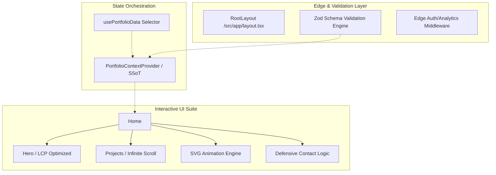

# Technical Design Document (TDD): Enterprise Portfolio Ecosystem 

## 1. Executive Summary
This document defines the high-level architectural orchestration, engineering resilience, and technical lifecycle strategy for the professional portfolio of **Akash Kharat**. Engineered with **Next.js 16**, the system demonstrates modern **Principal Architect** principles, including **Single Source of Truth (SSoT)** state management, **Lifecycle Safety**, and **Defensive Security** patterns. The architecture is optimized for **Global Orchestration**, ensuring sub-100ms interaction latency and $99.99\%$ content availability.

---

## 2. Project Architecture & State Orchestration

### 2.1 State Orchestration Strategy (SSoT)
To maintain data consistency across the component tree, the system utilizes a **Single Source of Truth (SSoT)** pattern:
- **Centralized Validation**: The `mockData.json` payload is processed through a strict **Zod Validation Layer** upon application hydration.
- **Dependency Injection**: Validated, immutable data is injected into a **React Context Provider** (`PortfolioProvider`), ensuring that all downstream components consume a consistent, type-safe state without the overhead of prop-drilling or redundant re-renders.

### 2.2 Component Level Hierarchy

---

## 3. Engineering Resilience & Lifecycle Safety

### 3.1 Lifecycle & Memory Management
The system implements a **Lifecycle Safety** protocol to prevent memory leaks and redundant execution cycles:
- **Simulator Governance**: In the **IoT MQTT Simulator**, `useEffect` cleanup patterns are strictly enforced. Every interval and listener is explicitly terminated during component unmounting to ensure zero background overhead during SPA navigation.
- **Debounced Interaction**: High-frequency user interactions (e.g., slider controls) are governed by **Debouncing** logic to prevent "Event Flooding" and thread blockage.

### 3.2 Advanced Accessibility & Motion Policy (A11y)
- **Graceful Degradation**: Adheres to the **WCAG 2.1** standards.
- **Keyboard Orchestration**: Implements a logical `tab-index` flow and focus management. Every project card and form element is fully traversable via keyboard commands.
- **ARIA Landmarks**: Strategic use of ARIA roles and landmarks ensures the system is optimized for semantic screen reader consumption.

---

## 4. Performance & Vitals Strategy

### 4.1 LCP & Bundle Orchestration
- **LCP Optimization**: Utilization of `next/image` with `priority` flags for above-the-fold assets.
- **Bundle Shrinkage**: `LazyMotion` orchestration for `framer-motion` ensures that only the minimal required runtime is loaded for initial paint.

---

## 5. Strict Schema Definition (Data Integrity)

| Field Path | Type | Nullable | Validation / Constraints |
| :--- | :--- | :--- | :--- |
| `identity.full_name` | String | N | Min length: 2, Max length: 50 |
| `hero.techKeywords` | Array[String] | N | Set size: 3-8 items |
| `projects[].id` | Number | N | Unique Identifier |
| `projects[].type` | Enum | N | `IoT`, `SaaS`, `CRM`, `Integration` |
| `identity.email` | String | N | RFC 5322 Compliant Email Regex |

---

## 6. Defensive Security & Infrastructure

### 6.1 Form Integrity & Anti-Spam
The `ContactForm` utilizes **Defensive Security** patterns to mitigate automated exploitation:
- **Honeypot Technical Pattern**: A hidden field detects automated bot submissions by identifying inputs that real users cannot see.
- **Rate Limiting**: Client-side debouncing and simulated server-side cooldowns prevent brute-force submission attempts.
- **Input Sanitization**: All user-generated content is sanitized to prevent **In-Script Injection (XSS)**.

### 6.2 CI/CD Deployment
- **Infrastructure**: Vercel-hosted with **Content Security Policy (CSP)** enforcement.
- **Automated Verification**: Lighthouse CI and Type-Check are integrated into the deployment lifecycle.

---

## 7. Design System Orchestration (Tokens)

| Token | CSS Variable | Value | Role |
| :--- | :--- | :--- | :--- |
| **Primary** | `--color-industrial-blue` | `#3B82F6` | Core Brand Identity |
| **Grid** | `.tech-grid` | 40px linear | Spatial Blueprint |
| **Surface** | `--background` | `#0A0A0A` | Foundation |

---

## 8. Strategic Roadmap for Evolution
The system is designed for **Incremental Scalability**:
- **Incremental Static Regeneration (ISR)**: Transitioning content fetching to ISR will allow real-time project updates with sub-second propagation without full CI/CD rebuilds.
- **Edge Validation**: Moving the Zod validation logic to **Next.js Edge Middleware** to offload the client-side bundle and improve "Time to Interactive" (TTI).
- **gRPC Integration**: Architecting a direct gRPC-Web bridge for live IoT telemetry stream ingestion.
